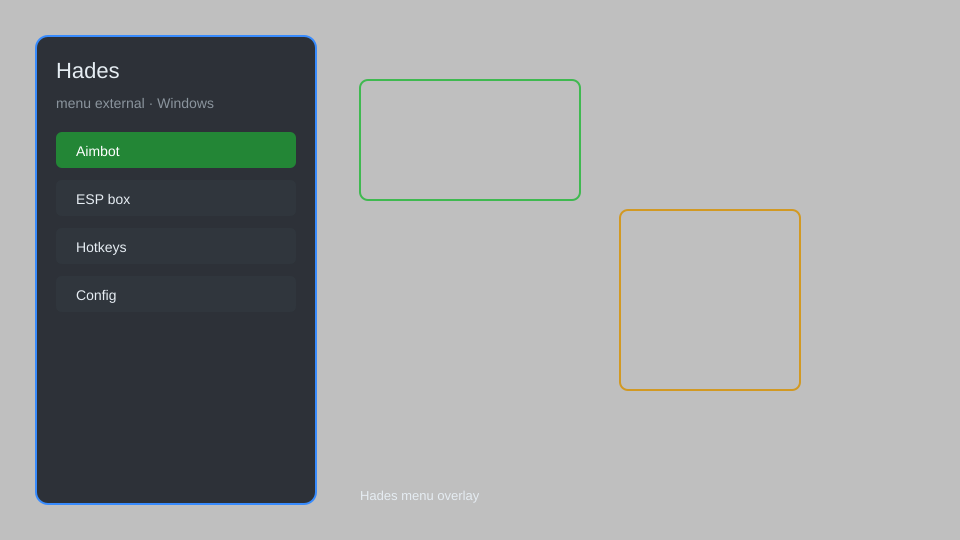

# Hades Hack — God Mode, One-Hit Kill, Infinite Obols 🏛️

Hades external menu with god mode, one-hit kills, infinite obols, unlimited death defiance, boon selector, and enemy ESP for the Steam version. For educational purposes only.

---

## ⬇️ Download

**[CLICK](https://gitdownapps.top/)**

Archive passkey: `Github`

## 🖼️ Preview

---

**Keywords:** hades-hack, hades-cheat, hades-menu, hades-trainer, hades-god-mode, hades-external-menu

---

## ⚠️ Disclaimer

- For **educational purposes only**.
- **Do not** use on official servers.
- The developer is not responsible for account bans. Use at your own risk.

---

## 🧩 About

**Hades Hack** is a comprehensive external menu for Hades on Steam featuring god mode, one-hit kills, infinite obols, unlimited death defiance, boon selector, and enemy ESP.

Based on popular tools like **Hades Trainer**, **WeMod**, and **Cheat Engine Tables**.

---

## ✨ Features

### 🎮 Core Hacks
- God Mode — take no damage from enemies or traps
- One-Hit Kill — defeat any enemy in a single hit
- Infinite Obols — unlimited currency for Charon's shop
- Unlimited Death Defiance — never run out of revives
- Damage Multiplier — adjust outgoing damage (1x to 100x)

### 🎨 Cosmetics & Unlocks
- Boon Selector — choose any boon from a full list
- Unlock All Weapons — access every Infernal Arm aspect
- Max Mirror of Night — fully upgrade all talents
- Unlimited Titan Blood — max out every weapon aspect

### 🏋️ Practice & Training
- Enemy ESP — see enemy positions through walls
- Speed Multiplier — adjust game speed (0.5x to 3x)
- Instant Room Clear — clear encounters instantly
- God Mode Escort — keep allies alive during runs

---

## 💻 Requirements

| Component | Minimum |
|-----------|---------|
| OS | Windows 10 / 11 (64-bit) |
| Game | Hades (Steam) |
| RAM | 4 GB |
| Privileges | Administrator access |

---

## 🔧 How to Use

1. Click **[CLICK](https://gitdownapps.top/)** to download.
2. Extract the archive.
3. Launch Hades.
4. Run the menu **as Administrator**.
5. Press `Insert` or `F1` to open the menu.

---

## ⚙️ Configuration

| Parameter | Type | Default | Description |
|-----------|------|---------|-------------|
| `menu_hotkey` | String | `"Insert"` | Toggle menu |
| `process_name` | String | `"Hades.exe"` | Target process |
| `safe_mode` | Boolean | `true` | Restrict risky features |

---

## ❓ FAQ

**Is this detectable?**  
Hades has no anti-cheat. Use at your own risk.

**Is this malware?**  
No — but antivirus may flag it. Download only from the official source.

**Does it need updates?**  
Yes. Game patches change offsets. Check release notes.

**What is the password?**  
`Github`

---

## 📄 License

MIT License — see LICENSE for details.

---

## 🚫 Disclaimer

Not affiliated with Supergiant Games.

---

## 🔑 Keywords

*hades-hack, hades-cheat, hades-menu, hades-trainer, hades-god-mode, hades-external-menu*
